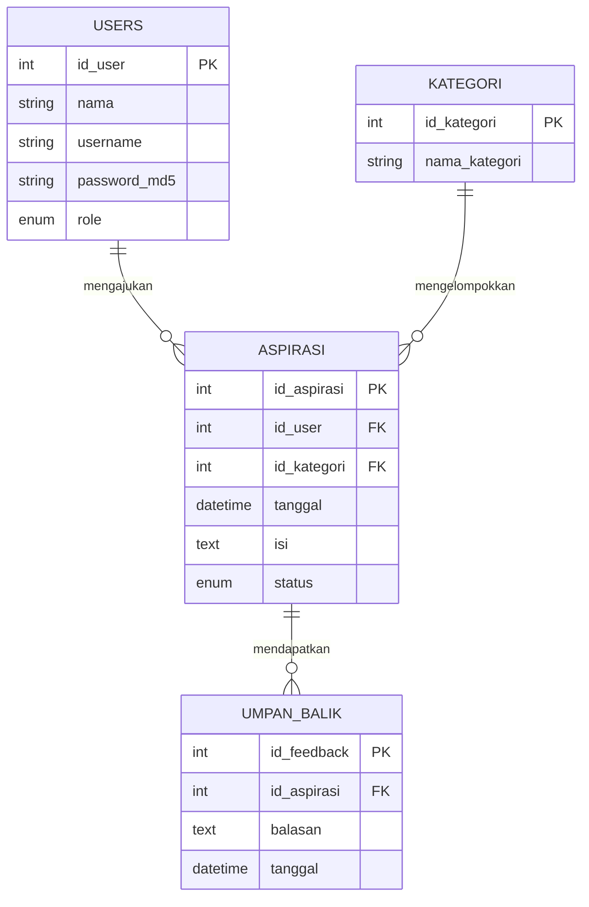
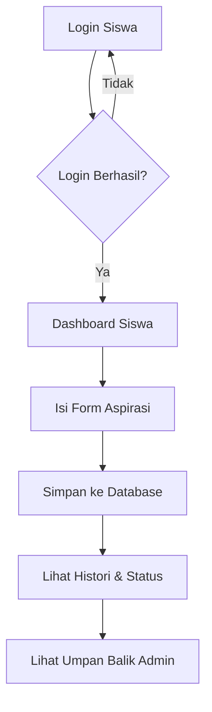
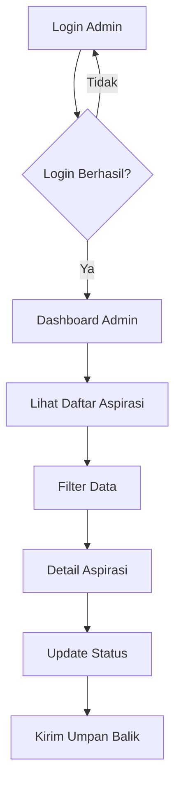

# Dokumentasi Aplikasi Pengaduan Sarana Sekolah

Aplikasi ini dirancang untuk memudahkan siswa dalam melaporkan kerusakan atau keluhan terkait sarana sekolah dan memungkinkan admin untuk mengelola laporan tersebut secara terorganisir.

## 1. Entity Relationship Diagram (ERD)

## 2. Flowchart Program

### Alur Siswa

### Alur Admin

## 3. Dokumentasi Fungsi & Prosedur

| Fungsi / Prosedur | Deskripsi | Parameter |
|-------------------|-----------|-----------|
| `redirect($url)` | Mengalihkan halaman ke URL tujuan. | `$url` (string) |
| `sanitize($data)` | Membersihkan input dari karakter berbahaya (XSS & SQL Injection). | `$data` (string) |
| `check_login()` | Memvalidasi apakah user sudah login melalui session. | - |
| `check_role($role)`| Memvalidasi hak akses user berdasarkan role (admin/siswa). | `$expected_role` (string) |
| `format_date($date)`| Mengubah format tanggal database ke format yang mudah dibaca. | `$date` (datetime) |
| `get_status_class($s)`| Mengembalikan class CSS Bootstrap berdasarkan status aspirasi. | `$status` (string) |

## 4. Laporan Debugging Singkat

Berikut adalah ringkasan proses debugging selama pengembangan:

1.  **Issue**: Muncul error "Undefined index" pada saat memproses filter di `list_aspirasi.php`.
    *   **Penyelesaian**: Menggunakan operator null coalescing (`??`) atau pengecekan `empty()` sebelum variabel digunakan di query.
2.  **Issue**: Password MD5 tidak cocok antara input login dan database.
    *   **Penyelesaian**: Memastikan input password di-hash `md5()` sebelum dibandingkan di query SQL.
3.  **Issue**: Relasi database gagal (Foreign Key Constraint) saat menghapus user.
    *   **Penyelesaian**: Menambahkan `ON DELETE CASCADE` pada relasi tabel `aspirasi` dan `umpan_balik`.
4.  **Issue**: UI berantakan di layar kecil.
    *   **Penyelesaian**: Mengoptimalkan grid Bootstrap menggunakan class `col-md-*` dan `table-responsive`.

## 5. Cara Penggunaan

1.  Import file `database.sql` ke dalam MySQL / phpMyAdmin.
2.  Sesuaikan konfigurasi database di `config/database.php`.
3.  Login menggunakan akun default:
    *   **Admin**: `admin` / `admin123`
    *   **Siswa**: `siswa` / `siswa123`
